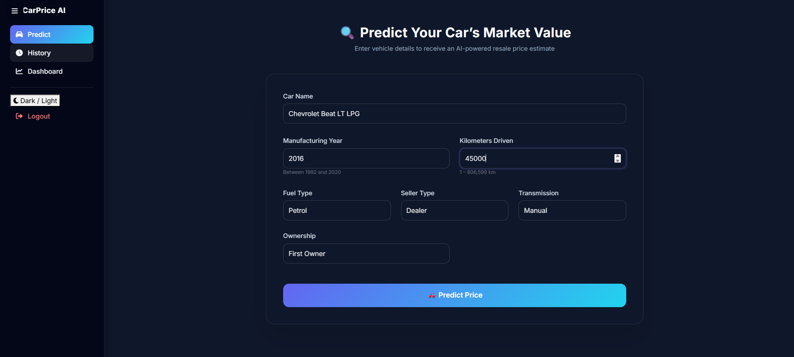
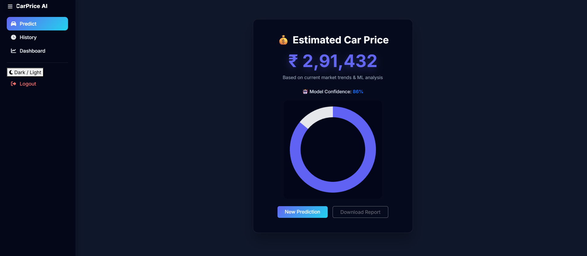
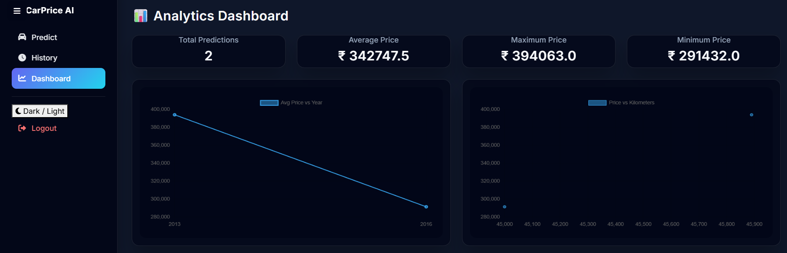

# 🚗 Car Price Prediction Web Application

A full-stack **Flask + Machine Learning** web application that predicts the resale price of cars based on real-world data.  
Built with a modern UI, secure authentication, analytics dashboard, and ML-powered predictions.

---

## 📌 Features

- 🔐 User Authentication (Login / Register)
- 🚘 Car Price Prediction using ML
- 📊 Interactive Analytics Dashboard
- 🧾 Prediction History with CSV Export
- 📄 Downloadable PDF Price Report
- 🌙 Modern UI with Dark / Light Mode
- 📱 Responsive & Mobile Friendly
- 🧠 Dataset-based realistic predictions

---

## 🧠 Machine Learning Model

- Algorithm: **Random Forest Regressor**
- Dataset: **Car Dekho Dataset**
- Target: `selling_price`
- Features:
  - Year
  - Kilometers Driven
  - Fuel Type
  - Seller Type
  - Transmission
  - Owner

---

## 🗂 Project Structure

```
Car_Price_Prediction/
│
├── app.py
├── database.db
├── model/
│   └── car_price_model.pkl
├── templates/
│   ├── base.html
│   ├── landing.html
│   ├── login.html
│   ├── register.html
│   ├── index.html
│   ├── result.html
│   ├── history.html
│   └── dashboard.html
├── static/
│   ├── style.css
│   ├── script.js
│   └── images/
│       └── bg-landing.jpg
|   ├── screenshots
├── training.ipynb
└── README.md
```

---

## 🖼 Screenshots

### 🔹 Landing Page


### 🔹 Login Page


### 🔹 Prediction Form


### 🔹 Prediction Result


### 🔹 Analytics Dashboard


### 🔹 Prediction History


---

## ⚙️ Installation & Setup

### 1️⃣ Clone the Repository
```bash
git clone https://github.com/your-username/car-price-prediction.git
cd car-price-prediction
```

### 2️⃣ Create Virtual Environment
```bash
python -m venv venv
venv\Scripts\activate   # Windows
source venv/bin/activate  # Linux/Mac
```

### 3️⃣ Install Dependencies
```bash
pip install -r requirements.txt
```

### 4️⃣ Run the Application
```bash
python app.py
```

App will run at:
```
http://127.0.0.1:10000
```

---

## 🌐 Hosting Options

- 🔹 Render (Recommended)
- 🔹 Railway
- 🔹 PythonAnywhere
- 🔹 AWS EC2

---

## 🧪 Sample Prediction

| Year | KMs Driven | Fuel | Transmission | Predicted Price |
|----|-----------|------|--------------|----------------|
| 2016 | 45000 | Petrol | Manual | ₹ 2,91,432 |

---

## 📌 Technologies Used

- **Backend:** Flask, SQLite
- **Frontend:** HTML, CSS, Bootstrap, JavaScript
- **ML:** Scikit-learn, Pandas, NumPy
- **Charts:** Chart.js
- **Reports:** ReportLab (PDF)

---

## 👩‍💻 Author

**Varshini**  
MCA Student – Manipal Institute of Technology  
Interests: Web Development, Data Analysis, Machine Learning  

---

## ⭐ If you like this project
Give it a ⭐ on GitHub and feel free to fork or contribute!
